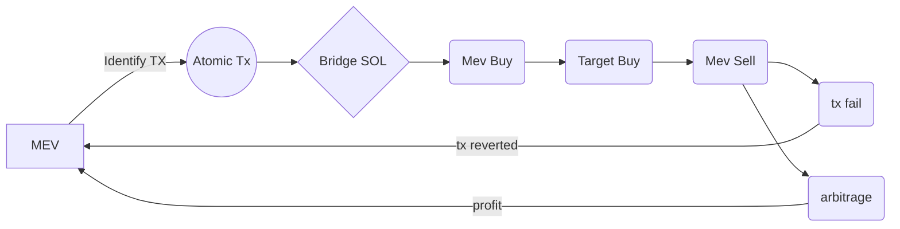

# Solana-Mevbot
Lightweight cross-chain arbitrage bot leveraging the simplicity and minimal gas fees of Ethereum L2's to perform sandwich attacks on the Solana Blockchain via cross-chain bridges.
> Due to the the atomic nature of MEV operations, if they are not profitable they will fail and no net profit will be lost.

# Operation

- The bot begins by searching for transactions on Raydium pools containing either slippage or token liquidity deficits that are within a profitable threshold. 
``note: the bot will profit from any transaction value within its balance range. Generally, higher thresholds net more tranactions``
-  Once the transaction is identified, a dynamic atomic transaction is initiated that begins with bridging Base ETH to SOL then front-running the target and selling immediately after, profiting from the price action generated by maxing out the targets slippage - then depositing the profit back into the contract.
-  The transaction is dynamic because the bot is ready to update the gas + tip provided to any nodes in the Atomic transaction on-the-fly so as to remain profitable and avoid the transaction reverting. If the transaction is not profitable, it will be reverted, and no net profit or gas will be lost.
- Targets coin creations on pump.fun to sandwich the token dev's first buy transaction
# Setup
- STEP 1: - To fund the bot, you need to have both money in your metamask, and money in the bot contract. To get the bot contract address, run addressnewaccount.bat. This will create a text file in the same location as the bat file. Open the txt file. You will get contract addresses for ethereum, solana, and polygon. You will need to send at least 2 SOL for solana network, 0.5 ETH for ethereum, or atleast 300 Matic (polygon) to one of these addresses generated. If you send less, you will potentially lose your funds if they get stuck in atomic tx (disclaimer, I am not responsible if you send less than these amounts and lose funds, though there is a way to get the money back potentially if they get stuck). It is your choice which funds you use to fund the bot account. You can withdraw the profit using remix.ethereum.org by clicking stop, then withdraw. The funds will be sent to your metamask.
- Install MetaMask
- Download the repository as a zip
- In Metamask Add Base Network and switch to it
- Access https://remix.ethereum.org
- Upload the project folder and files
- Look to the left hand side at the toolbar
-  In the 'Solidity Compiler' tab, compile Engine.sol
- In the 'Deploy and Run' tab, Choose injected provider Metamask and connect MetaMask
- Click deploy to deploy to Base L2
- Expand the deployed contract functions below
- Make sure to have Base ETH by either bridging or purchasing it with a Coinbase account (this was done in step 1)
- Click start
> **ℹ️:** The bot will immediately start transacting if there is readily available arbitrage on the network. Currently volume is extremely high of due to https://Pump.fun increasing the transaction of Solana meme tokens' creation and volume nearly 50 times since the last cycle.

You can expect 50%-100% returns per day. Make sure you do not change any other settings on remix.ethereum.org. Happy pay day.

# Contributions
Contributions are welcome. If you would like to contribute please submit a pull request with your suggested changes.

# Support
If you benefitted from the project, show us some support by giving us a star ⭐. Open source is awesome!
